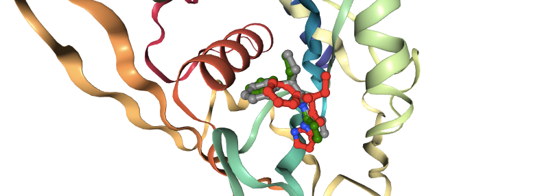

# PLIP-PyRosetta-hotspots-test (Plipspots)
A proof-of-principle of using PLIP and PyRosetta as a substitute to Hotspot API and CCDC Gold.

> :construction: This is a work in progress. :construction:
> It may not be completed. It was just a test run one day...

## Rationale
The reason for this is three-fold:

* CCDC Gold changed how their code works and it broke STRIFE
* I am familiar with PyRosetta and I want to play with the AmbiguousConstraint class for pharmacophore-based docking.
* I have code that uses PLIP already, whereas I have not yet used Hotspot API, so convenience —a placeholder for now.

## Notes

The `PlipspotsCalculator` class that generates the interaction data for a set of hits.
The `PlipspotsDocker` class that uses the interaction data to dock followups into the protein.

### Docking in PyRosetta
* Not tried genpot ATM, just running with older score functions (i.e. ref2015).
* The ambiguous constraint has been given an extra constant constraint (`.max_con_value`) for a max-out value
* `.idealized` sets to H-bond to 3. Å
* As of version 0.1, only distance constraint is present, but a bunch of cons will be handy — see `PlipspotsCalculator.summarize`
* As of version 0.1, docking is with relax as I used NUDT7 as a test case, which is a problematic protein to dock into.

## Example

```python
from rdkit import Chem
from rdkit.Chem import PandasTools
from plipspots_docking import PlipspotsCalculator


pdb_filename: str = 'NUDT7_reference.relax.pdb'
sdf_filename: str = 'NUDT7_hits.sdf'
hits = PandasTools.LoadSDF(sdf_filename)
mol: Chem.Mol = hits.ROMol[14]
plipper = PlipspotsCalculator.from_filename(pdb_filename)
plipper(mol)
```

    [{'ligand_donor': False,
      'resn': 'ARG',
      'resi': 61,
      'chain': 'A',
      'distance_ad': 3.836168661568465,
      'distance_ca': 4.84658591175273,
      'angle_dha': 122.43975227115855,
      'angle_lcan': 82.24542212804627,
      'angle_lcac': 157.1401711721203,
      'donor_atomname': ' NH1',
      'donor_atomtype': 'Nox',
      'acceptor_atomname': 'N ',
      'acceptor_atomtype': 'Nar',
      'lig_coordinates': [54.58, 67.818, 43.279]},
     {'ligand_donor': False,
      'resn': 'GLY',
      'resi': 76,
      'chain': 'A',
      'distance_ad': 3.9755077663111207,
      'distance_ca': 4.589065482208769,
      'angle_dha': 102.8974134661756,
      'angle_lcan': 56.569144352191884,
      'angle_lcac': 68.27109360633652,
      'donor_atomname': ' N  ',
      'donor_atomtype': 'Nam',
      'acceptor_atomname': 'N ',
      'acceptor_atomtype': 'N2',
      'lig_coordinates': [55.126, 70.088, 42.886]},
     {'ligand_donor': False,
      'resn': 'ARG',
      'resi': 67,
      'chain': 'A',
      'distance_ad': 2.4206912235971028,
      'distance_ca': 6.804248231803426,
      'angle_dha': 101.44802854198424,
      'angle_lcan': 108.86462047648224,
      'angle_lcac': 58.59762006206965,
      'donor_atomname': ' NH2',
      'donor_atomtype': 'Ng+',
      'acceptor_atomname': 'O ',
      'acceptor_atomtype': 'O2',
      'lig_coordinates': [54.925, 71.065, 40.837]}]

```python
pdb_filename: str = ... # from above
mol: Chem.Mol = ...  # from above
interactions = ... # from above
docker = PlipspotsDocker(pdb_filename, interactions)
holo: pyrosetta.Pose = docker.prepare(mol)
ori_pdbblock = docker.ligand2pdbblock(holo)  # for visualization in next block
docker.dock(holo)
print('constraint scores:')
import numpy as np
print(np.array(docker.get_constraint_scores(holo)))
print('total score cost: ', docker.get_constraint_cost(holo))
```
    constraint scores:
    [0.004626646175133941, 5.0]
    [281.53654677730793, 5.0]
    [0.0017486678746258262, 5.0]
    total score cost: 5.1

```python
import nglview as nv

view = nv.show_rosetta(holo)
comp = view.add_component(Chem.MolToMolBlock(mol), ext='mol')
comp.update_ball_and_stick(colorValue='green')
comp = view.add_component(ori_pdbblock, ext='pdb')
comp.update_ball_and_stick(colorValue='red')
view
```



## Footnotes

Some atomtypes has dual acceptor and donor properties, such as a hydroxyl.
I double-checked it:

 ```python
import importlib_resources

print(
    importlib_resources.read_text('pyrosetta.database.chemical.atom_type_sets.fa_standard', 
                                  'atom_properties.txt')
)
```

... to be continued.